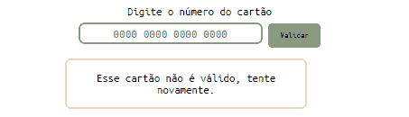

# Validação de cartão 

Primeiro projeto desenvolvido na turma SAP010 do bootcamp da Laboratória. 

## Aprendizados

Para fazer a validação, estudei sobre o Algoritmo Luhn e trabalhamos com os objetivos de aprendizagem (você consegue consultá-los através do README do projeto nas referências) e acredito ter atingido todas elas. No inicio do projeto enfrentei muita dificuldade em entender como o código deveria ser estruturado, mas com a ajuda das colegas e com muita leitura e muitos vídeos assistidos, consegui implementar o que era preciso para fazer a validação.
Aprendi, principalmente, a quebrar os problemas em probleminhas e ir resolvendo a parte lógica e prática de cada um deles, deixando um pouco de lado o todo, para conseguir avaliar e aprender melhor como resolver cada linha do código.

## Demonstração

## Experiência do usuário

Pensei em um layout o mais direto e claro possível, para que o usuário não "se perca" em funcionalidades que não eram importantes. Além disso, para maior credibilidade, fiz uma segunda página HTML contando um pouco sobre o método utilizado para a validação. Deixo abaixo a documentação das cores escolhidas para o projeto. 

## Documentação de cores

| Cor               | Hexadecimal                                                |
| ----------------- | --------------------------------------------------------------- |
| Cor do texto      |  #0B1B1E |
| Cor do background |  #899B82 |
| Cor dos detalhes  |  #EDD5BF |

## Referência

 - [README do projeto](https://github.com/Laboratoria/SAP010-card-validation)